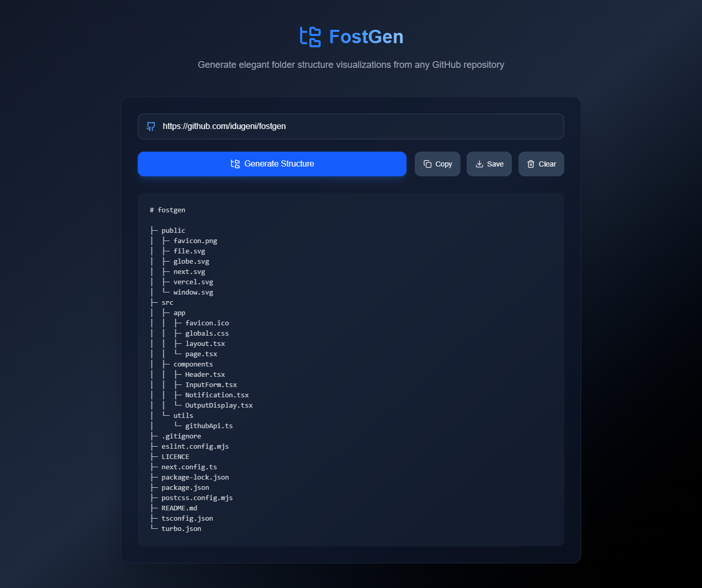

# FostGen — Folder Structure Generator

<div align="center">


</div>

Turn any public GitHub repository into a clean, shareable folder structure — as an
ASCII tree, a Markdown list, JSON, YAML or a flat path list.

- [Features](#features)
- [Preview](#preview)
- [Quick start](#quick-start)
- [Configuration](#configuration)
- [How it works](#how-it-works)
- [HTTP API](#http-api)
- [Project structure](#project-structure)
- [Scripts](#scripts)
- [Contributing](#contributing)
- [License](#license)

## Features

**Input** — paste almost anything that identifies a repository:

| Accepted | Example |
| --- | --- |
| Shorthand | `vercel/next.js` |
| Full URL | `https://github.com/vercel/next.js` |
| Deep link | `https://github.com/vercel/next.js/tree/canary/packages` |
| Blob link | `.../blob/canary/packages/next/package.json` |
| SSH remote | `git@github.com:vercel/next.js.git` |
| Raw URL | `https://raw.githubusercontent.com/vercel/next.js/canary/readme.md` |

Branches containing slashes (`release/2026-07`) are resolved automatically: the
server widens its guess at the branch/path boundary until GitHub agrees.

**Output**

- Five formats: ASCII tree, Markdown bullet list, JSON, YAML, flat paths.
- Optional code fence, trailing slashes and human-readable file sizes
  (directories show the sum of their contents).
- Depth limit, folders-only mode, and three sort orders.
- gitignore-style ignore patterns with `*`, `**`, `?`, a trailing `/` for
  directories and `!` to re-include something an earlier pattern excluded.
  A sensible default list (`node_modules`, lock files, build output, …) is on by
  default and can be switched off.
- Live stats: folder count, file count, depth and total size.
- Copy to clipboard or download with the right file extension per format.

**Experience**

- Every option re-renders instantly from data already in memory — no extra
  request to GitHub.
- Light/dark/system theme with no flash on first paint.
- Recent repositories, remembered locally.
- Keyboard shortcuts: <kbd>⌘/Ctrl</kbd>+<kbd>K</kbd> focuses the field,
  <kbd>⌘/Ctrl</kbd>+<kbd>Enter</kbd> generates.
- Accessible by construction: labelled controls, `role="switch"` toggles, live
  regions for notifications, and errors wired to their field via
  `aria-describedby`.

## Preview



## Quick start

Requires Node.js 20.9 or newer.

```sh
git clone https://github.com/idugeni/fostgen.git
cd fostgen
npm install
cp .env.example .env.local   # optional
npm run dev
```

Open <http://localhost:3000>.

## Configuration

All environment variables are optional — see [`.env.example`](.env.example).

| Variable | Purpose |
| --- | --- |
| `GITHUB_TOKEN` | Raises the GitHub rate limit from 60 to 5,000 requests/hour and unlocks private repositories the token can read. Server-only; it never reaches the browser. No scopes needed for public repos. |
| `NEXT_PUBLIC_SITE_URL` | Absolute origin for canonical URLs, `robots.txt` and `sitemap.xml`. Derived from `VERCEL_PROJECT_PRODUCTION_URL` on Vercel, otherwise defaults to `http://localhost:3000`. |
| `LOG_LEVEL` | `debug` \| `info` \| `warn` \| `error` \| `silent`. Defaults to `debug` in development, `info` in production. |

## How it works

```text
browser ──► GET /api/structure ──► GitHub REST API
                    │
                    └─► { repository, ref, path, nodes[], truncated, rateLimit }
                                │
                                └─► deriveStructure()  filter → aggregate → sort → render
```

GitHub is called from the server, not the browser. That means the optional token
stays private, responses are cached and shared between visitors, and anonymous
visitors are not billed against their own per-IP quota.

The response carries the **unfiltered** tree. All filtering, sorting and
rendering happens in one pure function, `deriveStructure`, so changing a format
or a depth limit is instant and the tests exercise exactly the same code path the
browser runs.

Two details worth calling out:

- Directories are identified by GitHub's `type` field, not inferred from "has
  children" — so **empty directories stay directories**.
- Submodules (`type: 'commit'`) are a distinct node type rather than being
  mislabelled as files.

## HTTP API

### `GET /api/structure`

| Query | Required | Description |
| --- | --- | --- |
| `url` | yes | Anything the input parser accepts. |
| `ref` | no | Branch, tag or commit-ish. Defaults to the repository's default branch. |
| `path` | no | Sub-directory to scope the tree to. |

```sh
curl 'http://localhost:3000/api/structure?url=idugeni/fostgen&path=src/lib'
```

Success responses are cached (`s-maxage=300, stale-while-revalidate=600`) and
shaped like:

```json
{
  "repository": { "fullName": "idugeni/fostgen", "defaultBranch": "main", "stars": 0 },
  "ref": "main",
  "path": "src/lib",
  "truncated": false,
  "treeSha": "…",
  "nodes": [{ "name": "tree", "path": "tree", "type": "dir", "children": [] }],
  "entryCount": 42,
  "rateLimit": { "limit": 60, "remaining": 58, "reset": 1900000000, "authenticated": false }
}
```

Failures are never cached and always carry a machine-readable code:

```json
{ "error": { "code": "RATE_LIMITED", "message": "…", "hint": "…", "retryAfter": 118 } }
```

Codes: `INVALID_URL`, `INVALID_REQUEST`, `NOT_FOUND`, `BRANCH_NOT_FOUND`,
`PATH_NOT_FOUND`, `EMPTY_REPOSITORY`, `RATE_LIMITED`, `UNAUTHORIZED`,
`UNAVAILABLE`, `NETWORK`, `UPSTREAM`, `UNKNOWN`.

## Project structure

```text
src/
├─ app/
│  ├─ api/structure/route.ts   GitHub resolution endpoint
│  ├─ layout.tsx               metadata, fonts, theme + toast providers
│  ├─ page.tsx                 server-rendered shell
│  ├─ error.tsx, not-found.tsx
│  └─ robots.ts, sitemap.ts, manifest.ts
├─ components/
│  ├─ generator/               form, options, summary, output, recents
│  ├─ layout/                  header, footer
│  ├─ theme/                   flash-free theme provider + toggle
│  ├─ ui/                      button, select, switch, badge, toaster
│  └─ icons/
├─ hooks/
│  ├─ useRepoStructure.ts      request lifecycle with abort handling
│  ├─ useLocalStorage.ts       useSyncExternalStore-backed persistence
│  └─ useClipboard.ts
└─ lib/
   ├─ api/schema.ts            zod query contract + response types
   ├─ github/                  URL parser, typed API client, types
   ├─ tree/                    build, filter, sort, stats, render, pipeline
   ├─ format/, utils/
   ├─ config.ts                defaults, persisted-state validation
   ├─ errors.ts                AppError + error-code taxonomy
   └─ logger.ts
```

## Scripts

| Script | Description |
| --- | --- |
| `npm run dev` | Development server (Turbopack). |
| `npm run build` / `npm start` | Production build and server. |
| `npm run lint` / `lint:fix` | ESLint flat config. |
| `npm run typecheck` | `tsc --noEmit`. |
| `npm test` / `test:watch` / `test:coverage` | Jest + Testing Library. |
| `npm run verify` | Lint, typecheck and test in one go. |

## Contributing

1. Fork and branch: `git checkout -b feat/my-change`.
2. Make the change and keep `npm run verify` green.
3. Open a pull request describing the behaviour that changed.

## License

[MIT](LICENCE).
